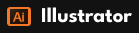
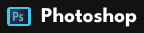
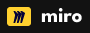
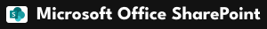
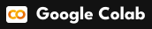
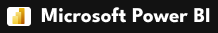

print("Eu sou a Marina Micas")

  
Acesse meu <a href="https://marinamicas.github.io/marinamicas/" target="_blank">portfólio completo</a> e/ou meu <a href="files/Curriculo_Marina Micas Jardim.pdf" target="_blank">currículo</a>. 
  
  

 

