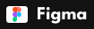
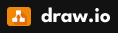
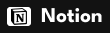
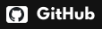
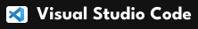

print("Eu sou a Marina Micas")

  
<a href="https://marinamicas.github.io/marinamicas/" target="_blank">Acesse o meu portfólio completo</a>
  
<a href="arquivos/Curriculo_Marina Micas Jardim.pdf" target="_blank">Meu currículo</a>
  

 
  

