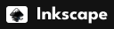
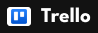
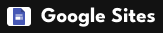
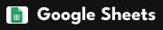
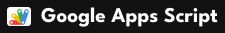
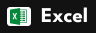

print("Eu sou a Marina Micas")

print("Adoro criar analogias e minha marca se análoga com a flor tulipa")

<a href="arquivos/Curriculo_Marina Micas Jardim.pdf" target="_blank">Meu currículo</a>

<a href="https://www.instagram.com/bhaaratrestauranteindiano/" target="_blank">Instagram da logo bhaarat de cozinha indiana</a>
<a href="https://www.linkedin.com/company/bhaarat-restaurante-indiano/" target="_blank">LinkedIn da logo bhaarat de cozinha indiana</a> 
<a href="https://marinamicas.github.io/marinamicas/" target="_blank">Acesse o meu portfólio completo</a>

